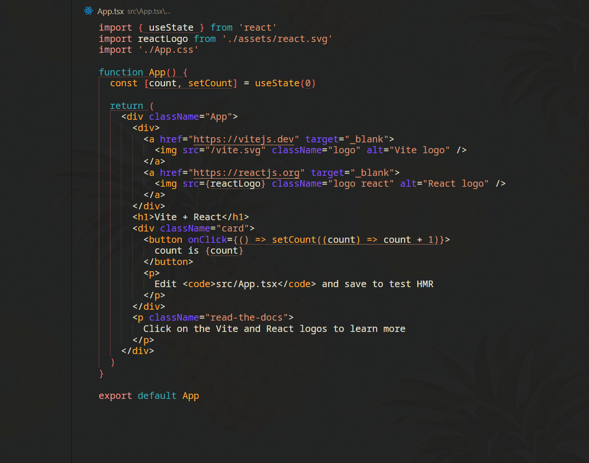

   

<h1 style="text-align: center;">Horizon Laker Color</h1>

> This VSCode color scheme is a fork of the good old [Horizon Theme](https://github.com/jolaleye/horizon-theme-vscode).

> The screenshot shows my background slightly, this is due to an additional VS Code extension called [GlassIt-VSC](https://marketplace.visualstudio.com/items?itemName=s-nlf-fh.glassit).

## Contributing

Feel free to open a pull request or an issue on [GitHub](https://github.com/JulienQNN/vscode-horizon-laker-theme).

## License

[MIT](LICENSE.md) © [Julien QUENNEHEN](https://github.com/JulienQNN/vscode-horizon-laker-theme)
